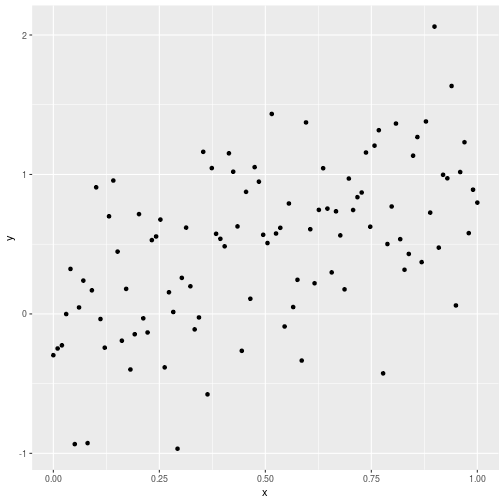
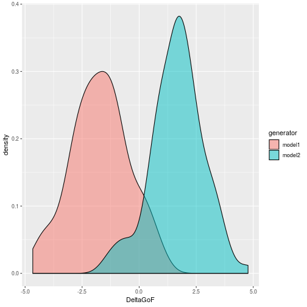

<!-- README.md is generated from README.Rmd. Please edit that file -->


# pbcm

pbcm is an R package that implements both data-informed and data-uninformed versions of the Parametric Bootstrap Cross-fitting Method (PBCM; Wagenmakers et al. 2004), a general-purpose technique for binary model selection. Some auxiliary routines, such as decision through *k* nearest neighbours classification (Schultheis & Singhaniya 2015), are also implemented.

## Installation

You can install the released version of pbcm from [CRAN](https://CRAN.R-project.org) with:

``` r
install.packages("pbcm")
```

## Basic usage

Suppose we have the following data:


```r
x <- seq(from=0, to=1, length.out=100)
mockdata <- data.frame(x=x, y=x + rnorm(100, 0, 0.5))
library(ggplot2)
g <- ggplot(mockdata, aes(x=x, y=y)) + geom_point()
print(g)
```



Suppose we wish to find out which of the following two models best explains these data:

* Model 1: `y = a*x + E`
* Model 2: `y = a*x^2 + E`

where `E` is some Gaussian noise.

The first thing to do is to define our own routine for fitting these models. We could use a dedicated routine for each model, but because of the simplicity of the example and the obvious parallels between the two models, we're in fact going to parameterize a single function. We're going to use R's implementation of nonlinear least squares, `nls`, here:


```r
myfitfun <- function(data, p) {
  res <- nls(y~a*x^p, data, start=list(a=1.1))
  list(a=coef(res), GoF=deviance(res))
}
```

Note that `myfitfun` takes a (mandatory) `data` argument which is used to pass the data the models are fit to, and that it returns a list, one of whose elements holds the goodness of fit (`GoF`).

To generate the parametric bootstrap, we need another function that generates synthetic data based on a model parameterization:


```r
mygenfun <- function(model, p) {
  x <- seq(from=0, to=1, length.out=100)
  y <- model$a*x^p + rnorm(100, 0, 0.5)
  data.frame(x=x, y=y)
}
```

This function takes a mandatory `model` argument, which is used to pass around model realizations (the output of the `myfitfun` function).

Now we're set to actually run the bootstrap:


```r
myboot <- pbcm::pbcm.di(data=mockdata, fun1=myfitfun, fun2=myfitfun, genfun1=mygenfun, genfun2=mygenfun, reps=100, args1=list(p=1), args2=list(p=2), genargs1=list(p=1), genargs2=list(p=2))
```

Here, `args1` and `args2` hold arguments passed to `myfitfun`, while `genargs1` and `genargs2` hold arguments passed to `mygenfun`. Let's take a glimpse at the result:


```r
head(myboot)
#>   model1_p model2_p rep generator     GoF1     GoF2   DeltaGoF
#> 1        1       NA   1    model1 28.34446 31.82117 -3.4767105
#> 2        1       NA   2    model1 20.41371 24.82730 -4.4135849
#> 3        1       NA   3    model1 20.58190 26.22336 -5.6414614
#> 4        1       NA   4    model1 19.99064 24.80944 -4.8187993
#> 5        1       NA   5    model1 23.56303 22.92738  0.6356444
#> 6        1       NA   6    model1 21.42545 25.52795 -4.1025049
```

We can easily produce a nice plot of the `DeltaGoF` distributions:


```r
g <- ggplot(myboot, aes(x=DeltaGoF, fill=generator)) + geom_density(alpha=0.5)
print(g)
```




## References

Schultheis, H. & Singhaniya, A. (2015) Decision criteria for model comparison using the parametric bootstrap cross-fitting method. *Cognitive Systems Research*, 33, 100–121.

Wagenmakers, E.-J., Ratcliff, R., Gomez, P. & Iverson, G. J. (2004) Assessing model mimicry using the parametric bootstrap. *Journal of Mathematical Psychology*, 48(1), 28–50.
