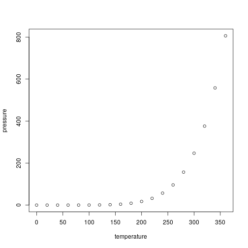

<!-- README.md is generated from README.Rmd. Please edit that file -->


# pbcm

pbcm is an R package that implements both data-informed and data-uninformed versions of the Parametric Bootstrap Cross-fitting Method (PBCM; Wagenmakers et al. 2004), a general-purpose technique for binary model selection. Some auxiliary routines, such as decision through *k* nearest neighbours classification (Schultheis & Singhaniya 2015), are also implemented.

## Installation

You can install the released version of pbcm from [CRAN](https://CRAN.R-project.org) with:

``` r
install.packages("pbcm")
```

## Basic usage

Suppose we have the following data:

``` r
x <- seq(from=0, to=1, length.out=100)
mockdata <- data.frame(x=x, y=x + rnorm(100, 0, 0.5))
```

and we wish to find out which of the following two models best explains these data:

* Model 1: $y = ax + \epsilon$
* Model 2: $y = ax^2 + \epsilon$

where $\epsilon$ is some Gaussian noise.


This is a basic example which shows you how to solve a common problem:


```r
## basic example code
```

What is special about using `README.Rmd` instead of just `README.md`? You can include R chunks like so:


```r
summary(cars)
#>      speed           dist       
#>  Min.   : 4.0   Min.   :  2.00  
#>  1st Qu.:12.0   1st Qu.: 26.00  
#>  Median :15.0   Median : 36.00  
#>  Mean   :15.4   Mean   : 42.98  
#>  3rd Qu.:19.0   3rd Qu.: 56.00  
#>  Max.   :25.0   Max.   :120.00
```

You'll still need to render `README.Rmd` regularly, to keep `README.md` up-to-date.

You can also embed plots, for example:



In that case, don't forget to commit and push the resulting figure files, so they display on GitHub!


## References

Schultheis, H. & Singhaniya, A. (2015) Decision criteria for model comparison using the parametric bootstrap cross-fitting method. *Cognitive Systems Research*, 33, 100–121.

Wagenmakers, E.-J., Ratcliff, R., Gomez, P. & Iverson, G. J. (2004) Assessing model mimicry using the parametric bootstrap. *Journal of Mathematical Psychology*, 48(1), 28–50.
